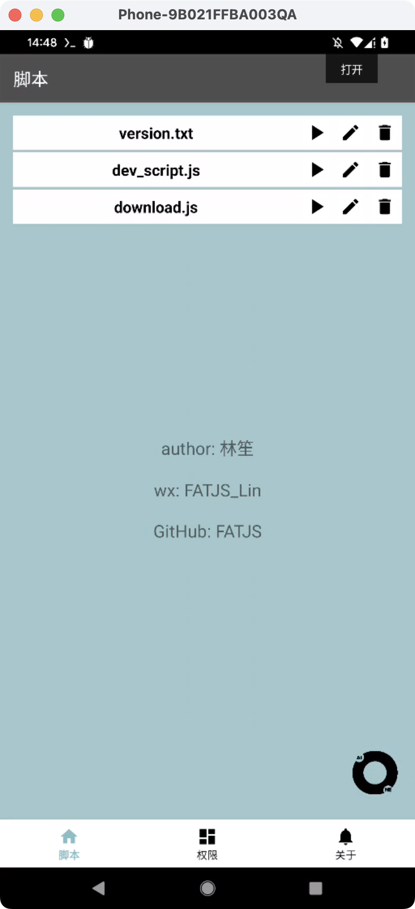
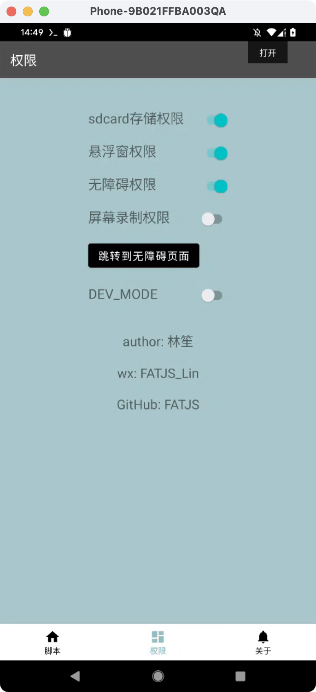
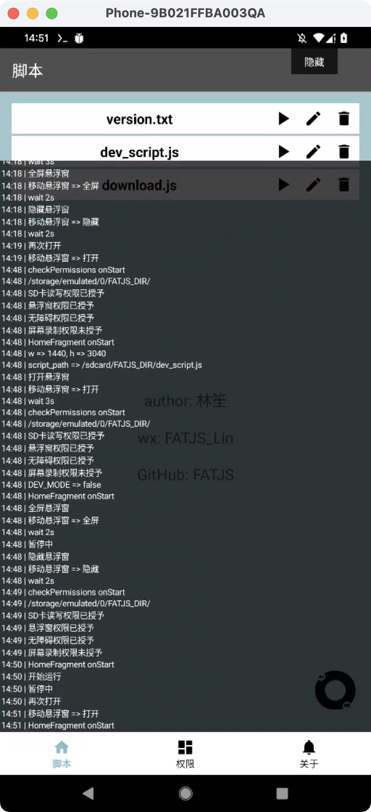
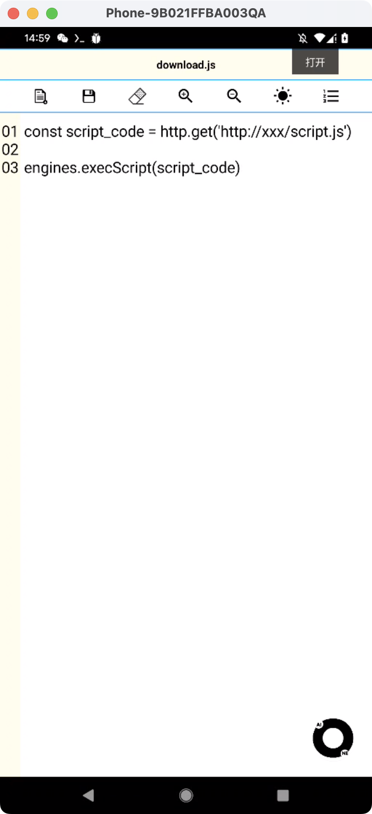
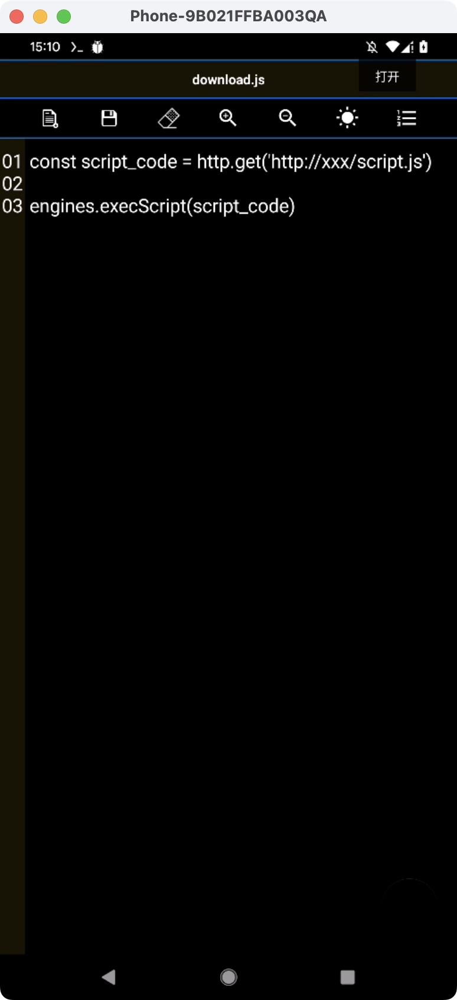

# FATJS介绍

#### 基于linsheng_FATJS开源代码二次开发修改
>FATJS 基于安卓无障碍的自动化框架｜集成找色模块｜引入JS引擎｜Api类似Autojs
>添加了设置和读取剪切板内容

|作者|zhazhahui|
|---|---

#### 需要注意的点
>1. （仅用于学习交流，切勿用于非法途径！）
>2. （仅用于学习交流，切勿用于非法途径！）
>3. （仅用于学习交流，切勿用于非法途径！）

#### 预览图

|  |  |  |
| ------------------------------------------------------------ | ------------------------------------------------------------ | ------------------------------------------------------------ |
|  |  |  |

#### js脚本示例

```js
showLog() //打开悬浮窗
print('返回桌面') //打印日志
home()
print('点击设置')
text('设置').boundsInScreen().untilFindOne().click()  //当前页面中快速查找点击
sleep(2000) //等待2s
back() //返回
hideLog() //隐藏悬浮窗
click(100, 200) // 点击坐标
capture('/sdcard/1.png') // 截屏

clip('剪贴板文本');  //设置剪切板内容
let clipboardText = getClip();
if (clipboardText) {
    print("剪贴板内容: " + clipboardText);  //打印剪切板内容
} else {
    print("剪贴板为空或无法获取内容");
}

sleep(random(5000,6000))  //随机5~6秒
const minX = 400;  
const maxX = 500;  
const minY = 700;  
const maxY = 800; 
const x = Math.floor(Math.random() * (maxX - minX + 1)) + minX;  
const y = Math.floor(Math.random() * (maxY - minY + 1)) + minY;  
doubleClick(x,y);   //屏幕指定区域双击
```
